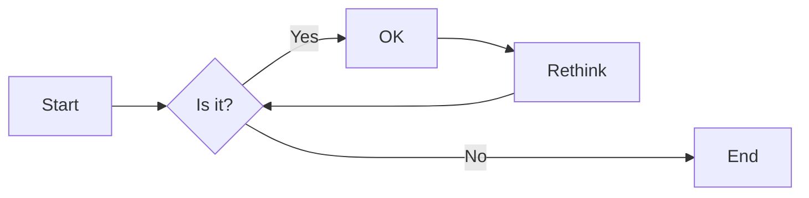
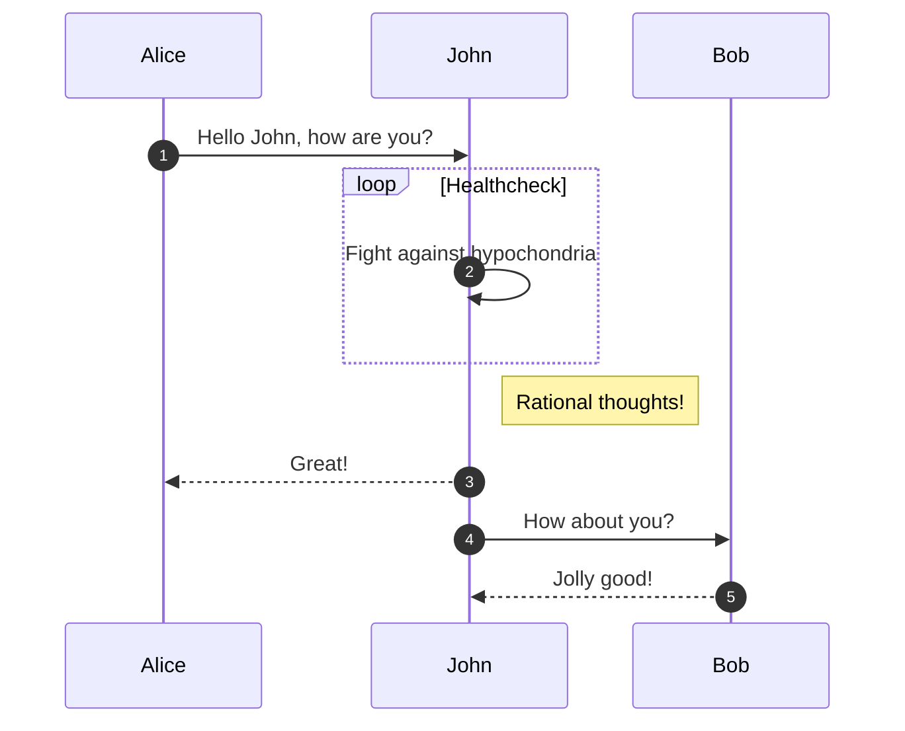
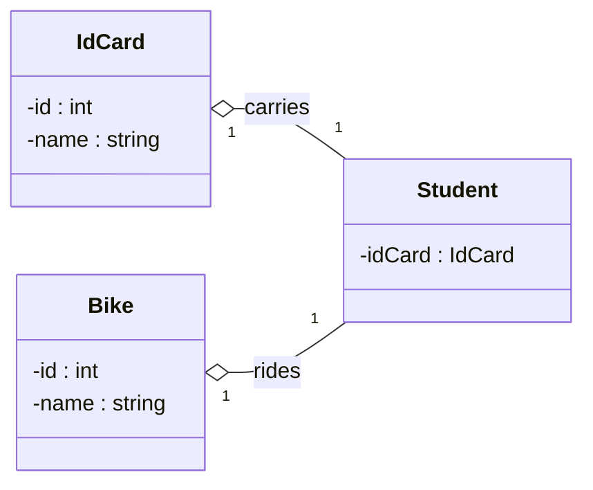
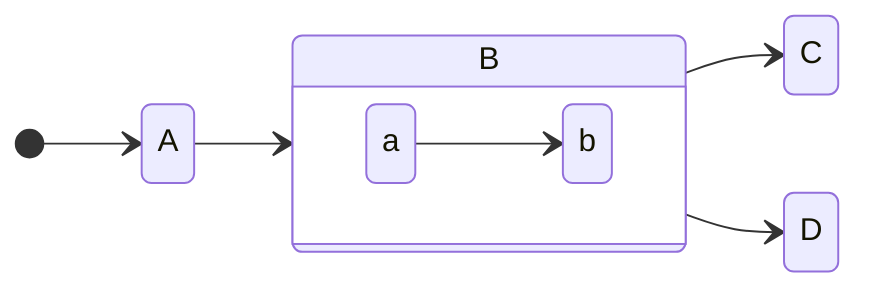

# Mermaid Markdown Samples

Samples from https://mermaid-js.github.io/mermaid

- [Flowchart](https://github.com/junkofujiwara/mermaid-md-samples/blob/main/flowchart.md)

- [Sequence Diagram](https://github.com/junkofujiwara/mermaid-md-samples/blob/main/sequence-diagram.md)

- [Class Diagram](https://github.com/junkofujiwara/mermaid-md-samples/blob/main/class-diagram.md)

- [State Diagram](https://github.com/junkofujiwara/mermaid-md-samples/blob/main/state-diagram.md)

References
- [About Mermaid](https://mermaid-js.github.io/mermaid)
- [About writing and formatting on GitHub](https://docs.github.com/en/get-started/writing-on-github/getting-started-with-writing-and-formatting-on-github/about-writing-and-formatting-on-github)
- [Include diagrams in your Markdown files with Mermaid](https://github.blog/2022-02-14-include-diagrams-markdown-files-mermaid/)
